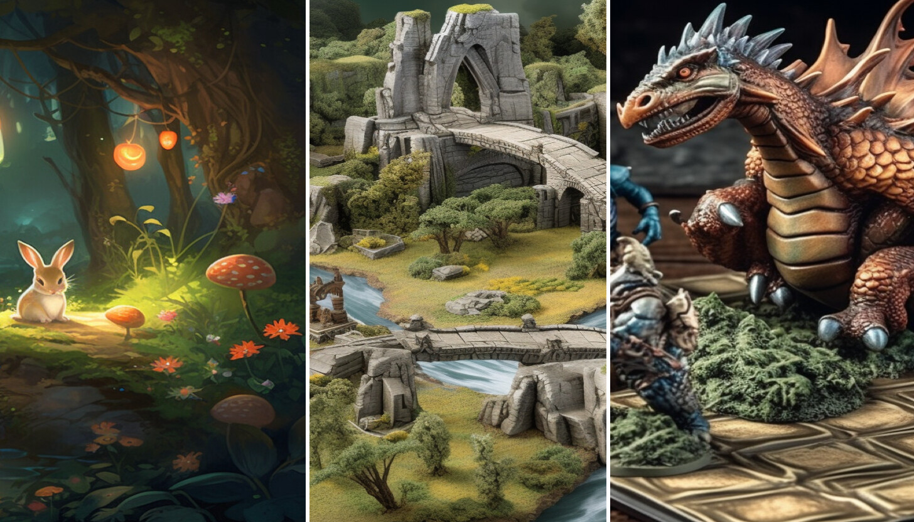

[](#)

欢迎来到 Copilot 冒险！这一系列编程冒险旨在通过使用 [GitHub Copilot](https://github.com/features/copilot) 帮助你编写代码来学习新概念和语言。让我们开始吧！

## 选择你的 Copilot 冒险

[](#)

### 1. 进入冒险竞技场

要开始，请点击下面的按钮进入“冒险竞技场”。这将创建一个你可以使用的 GitHub Codespace。一旦加载完成，选择 **创建 codespace** 按钮。

[](https://codespaces.new/microsoft/CopilotAdventures)

**注意：** 你每月可以使用 60 小时 GitHub Codespaces [免费](https://github.com/features/codespaces#pricing)。

如果你愿意，你也可以克隆仓库并在本地运行：

```bash
git clone https://github.com/microsoft/copilotadventures
```

### 2. 选择一个冒险

**前提条件：** 有基本的编程语言知识是有帮助的。

#### GitHub Copilot 新手？

如果你是 GitHub Copilot 的新手，需要安装扩展并且想要学习如何开始使用它，请从 **[热身冒险](./Adventures/Warmup-Adventure_chs.md)** 开始。

一旦完成热身冒险并安装了扩展，请从下面的列表中选择另一个 GitHub Copilot 冒险：

#### 初学者冒险

- **[Tempora 的钟表城](./Adventures/1-Beginner/The-Clockwork-Town-of-Tempora_chs.md)** - 在机械城镇 Tempora，一切都由钟表和精确的计时操作。城镇的心脏是大钟塔，负责为所有城镇的活动保持时间。然而，随着时间的推移，城镇中的一些小钟表开始偏离准确时间。
- **[Algora 的魔法森林](./Adventures/1-Beginner/The-Magical-Forest-of-Algora_chs.md)** - 在迷人的 Algora 森林深处，每千年，两只神秘生物洛克斯和法伊丽斯会进行神圣的舞蹈。这个舞蹈不仅仅是为了庆祝，而是为了给森林带来平衡的仪式。

#### 中级冒险

- **[Lumoria 的天体排列](./Adventures/2-Intermediate/The-Celestial-Alignment-of-Lumoria_chs.md)** - 在广袤的 Galaxia 星云中，Lumoria 星系即将发生一种罕见现象。围绕 Lumorian 太阳旋转的行星正以每几千年一次的频率排列。这种排列对 Lumorian 太阳照射到每个行星的光线有独特的影响。
- **[Stonevale 的传奇决斗](./Adventures/2-Intermediate/The-Legendary-Duel-of-Stonevale_chs.md)** - 在神秘的 Stonevale 王国，罗克和帕皮拉被选中进行一场决定他们部落下个世纪命运的决斗。竞技场 Scissoria，每一步都充满了重量和后果。
- **[Eldoria 的卷轴](./Adventures/2-Intermediate/The-Scrolls-of-Eldoria_chs.md)** - 在 Eldoria 的魔法世界里，古老的卷轴隐藏着宇宙的秘密。然而，这些卷轴被长老们用强大的咒语分散和保护。随着时间的推移，这些卷轴被数字化并存储在 Eldoria 大图书馆中，只能通过 Eldoria 知识网访问。

#### 高级冒险

- **[Mythos 的 Gridlock 竞技场](./Adventures/3-Advanced/The-Gridlock-Arena-of-Mythos_chs.md)** - 在 Mythos 的神秘土地上，各种王国的生物齐聚在 Gridlock 竞技场，这是一个测试策略、力量和智慧的棋盘格子。每个生物都有其独特的移动、力量和策略。

### 3. 开始编程

阅读你的 Copilot 冒险描述，执行的高层次任务以及 GitHub Copilot 提示以帮助你编写代码。

- 使用 [GitHub Copilot](https://docs.github.com/en/copilot/getting-started-with-github-copilot) 和/或 [GitHub Copilot Chat](https://docs.github.com/en/copilot/github-copilot-chat/using-github-copilot-chat) 帮助你为冒险编写代码。你可以使用任何你喜欢的语言。如果你敢于挑战，试着学习一种新语言（更多内容如下）！
- 在代码中留下任何评论，以解释你的思路并展示 GitHub Copilot 用来帮助你的提示。

### 4. 提交你的冒险解决方案（可选）

如果你想与他人分享你的解决方案，请执行以下步骤：

- 将你的冒险解决方案发布到一个 GitHub 仓库。
- 访问 https://github.com/microsoft/CopilotAdventures/issues 并选择 `New Issue`。
- 使用以下命名约定作为问题标题。

    ```
    Solution for [Name of Your Adventure]
    ```

    将`[Name of Your Adventure]` 替换为你选择解决的冒险名称（例如：`The Legendary Duel of Stonevale`）。

- 在正文部分添加指向你的 GitHub 仓库的链接。
- 如果你有任何反馈，请分享你的发现（好的或坏的）。我们很想听到你的反馈！

## 下一步：学习一种新语言或为你的冒险创建一个 UI

[](#)

完成你的第一个冒险后，再次尝试，但这次使用 GitHub Copilot 用一种对你来说新的语言来完成冒险。例如，如果你通常用 C# 编写代码，使用 Copilot 帮助你用 Python 或其他你想学习的语言来解决冒险。

试着为你的冒险创建一个 UI。使用纯 HTML/CSS/JavaScript 或你选择的库/框架。让 GitHub Copilot/Chat 帮助你编写 UI 代码。如果你的 UI 需要图像，请考虑使用 [Bing Image Creator](https://www.bing.com/create) 或其他 AI 图像生成服务。

## 有 Copilot 冒险创意？提交 PR！

你有合适的 Copilot 冒险故事/谜题想提交给其他人体验吗？我们很想看到！请向该仓库提交你的冒险和解决方案的拉取请求。

- 使用 `New Copilot Adventure: [Your Adventure Name]` 作为 PR 标题。将 `[Your Adventure Name]` 替换为你的冒险名称。
- 包含你的冒险是初学者、中级还是高级级别。
- 在创建冒险时，请遵循 [冒险](./Adventures) 文件夹中每个冒险使用的 markdown 模板。
- 为你的冒险提供一个图像（使用 [Microsoft Copilot Image Creator](https://www.bing.com/images/create) 或其他图像生成解决方案）。图像应为“横向”，尺寸为 1456x832 像素。
- 使用你选择的语言提供一个解决方案。将所有代码放在一个文件中（为了保持简单），将其添加到 `Solutions` 中的适当语言文件夹中，并将其包含在 PR 中。

我们将审查你的提交，如果符合条件将其合并到仓库中